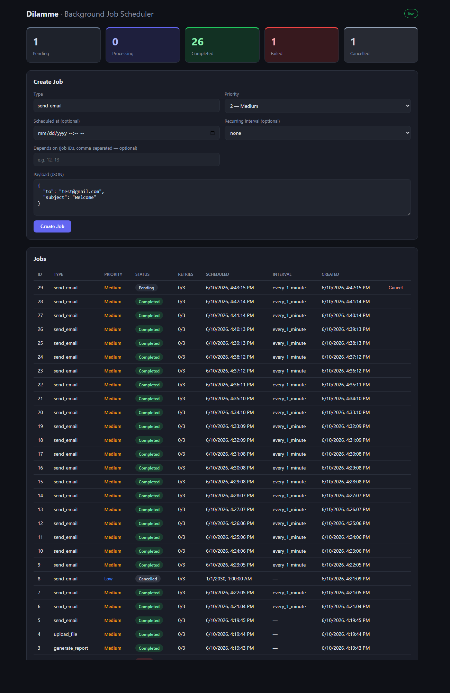
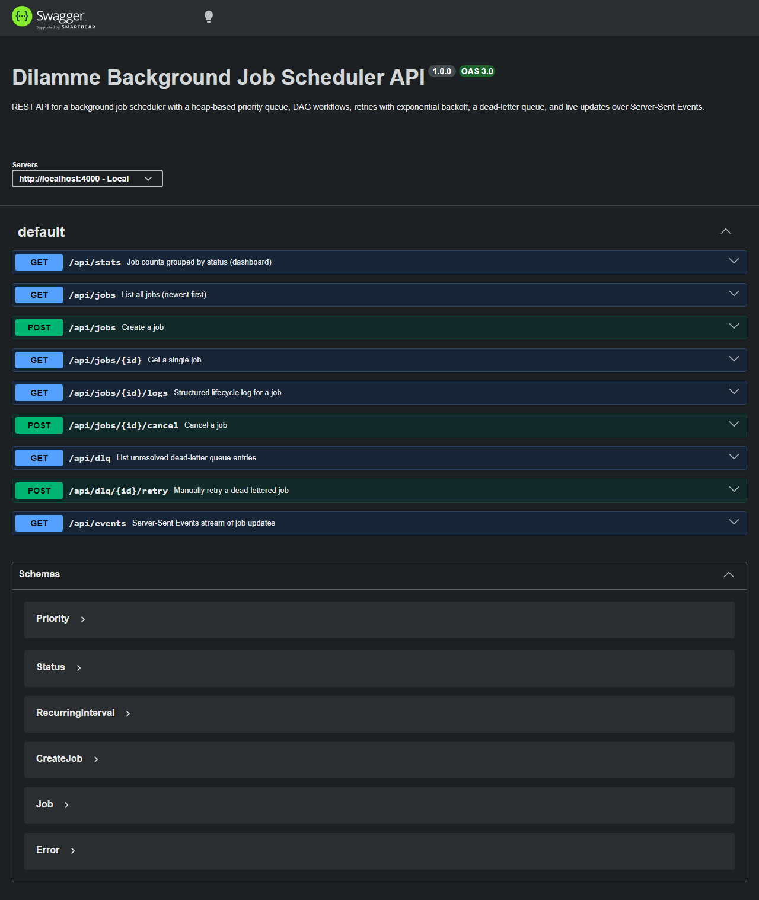

<div align="center">

# ⚙️ Dilamme — Background Job Scheduler

**A production-style background job scheduler with a heap priority queue, DAG workflows, automatic retries, a dead-letter queue, and a live React dashboard.**

[](https://nodejs.org)
[](https://www.typescriptlang.org/)
[](https://expressjs.com/)
[](https://www.postgresql.org/)
[](https://react.dev/)
[](#-testing)

</div>

---

## 📸 Screenshots

### Live Dashboard


### API Docs (Swagger UI)


---

## ✨ Features

| Capability | Summary |
|------------|---------|
| **Heap priority queue** | Binary min-heap orders jobs by priority → scheduled time → creation time |
| **Alternative scheduler** | Hashed timing wheel, benchmarked against the heap |
| **DAG workflows** | Jobs run only after all dependencies complete |
| **Independent workers** | Separate processes; the API never waits on job execution |
| **Automatic retries** | Up to 3, with exponential backoff + jitter (~1s / ~5s / ~25s) |
| **Dead-letter queue** | Exhausted jobs land here with errors; manual retry; email alert at threshold |
| **Scheduled jobs** | Future `scheduled_at` jobs wait until due |
| **Recurring jobs** | Re-schedule themselves on completion (`every_1_minute` / `_5_minutes` / `_1_hour`) |
| **Cancellation** | Pending → cancelled instantly; processing → finishes, never retries/recurs |
| **Duplicate protection** | Atomic SQL claim — one job is never run by two workers |
| **Starvation prevention** | Aging promotes long-waiting low-priority jobs |
| **Live updates** | Server-Sent Events — UI updates with no refresh |
| **Structured logging** | One JSON event per lifecycle step, persisted to `job_logs` |

---

## 🏗️ Architecture

```
        ┌─────────────┐   HTTP / SSE    ┌──────────────┐
        │   React UI  │◄───────────────►│  API (Express)│
        └─────────────┘                 └──────┬───────┘
                                               │ SQL + LISTEN/NOTIFY
                                               ▼
                                       ┌────────────────┐
                                       │   PostgreSQL   │
                                       └───────┬────────┘
                                               │ claim / update (SKIP race)
                                        ┌──────▼───────┐
                                        │  Worker(s)   │  N independent processes
                                        └──────────────┘
```

Full design write-up (heap internals, timing-wheel benchmark, duplicate protection, aging, DLQ threshold, cancellation decision) lives in **[docs/ARCHITECTURE.md](docs/ARCHITECTURE.md)**.

### Project structure

```
stage9-job-scheduler/
├── src/
│   ├── config/        env + pg pool
│   ├── db/            schema.sql + migrate
│   ├── models/        Job types
│   ├── queues/        heap.ts · timingWheel.ts · comparator.ts (aging)
│   ├── services/      job · scheduler · retry · dlq · alert
│   ├── workers/       worker.ts + handlers/ (email simulation)
│   ├── controllers/   request handlers
│   ├── routes/        REST + SSE routes
│   ├── events/        notify (pg_notify) + sse relay
│   ├── utils/         structured logger
│   ├── app.ts         express app (CORS *, swagger)
│   └── server.ts      bootstrap
├── frontend/          React + Vite dashboard
├── bench/             heap vs timing-wheel benchmark
├── tests/             vitest unit tests
├── docs/              ARCHITECTURE · openapi.yaml · postman · screenshots
└── deploy/            nginx.conf
```

---

## 🚀 Quick start

### Prerequisites
- Node.js 18+ (tested on 23)
- PostgreSQL 14+ running locally

### 1. Backend

```bash
git clone <repo-url>
cd stage9-job-scheduler
npm install
cp .env.example .env        # then set DATABASE_PASSWORD etc.
npm run migrate             # creates the DB + tables
npm start                   # API on http://localhost:4000
```

In a second terminal, start a worker (you can start several):

```bash
npm run worker
```

### 2. Frontend

```bash
cd frontend
npm install
npm run dev                 # UI on http://localhost:5173
```

The UI talks to `http://localhost:4000` by default (override with `VITE_API_URL`).

### Scripts

| Command | Description |
|---------|-------------|
| `npm start` | run the API (compiled) |
| `npm run dev` | API in watch mode |
| `npm run worker` | run a worker process |
| `npm run build` | compile TypeScript |
| `npm run migrate` | create DB + apply schema |
| `npm run bench [N]` | benchmark heap vs timing wheel |
| `npm test` | run unit tests |

---

## ⚙️ Configuration

All configurable via `.env` (see `.env.example`). Documented defaults:

| Variable | Default | Meaning |
|----------|---------|---------|
| `MAX_RETRIES` | `3` | retry attempts before the DLQ |
| `BACKOFF_BASE_SECONDS` / `BACKOFF_FACTOR` | `1` / `5` | backoff → ~1s, ~5s, ~25s |
| `BACKOFF_JITTER` | `0.2` | ±20% jitter on each backoff |
| `DLQ_ALERT_THRESHOLD` | `5` | **unresolved DLQ count that fires an email alert** |
| `AGING_BUMP_SECONDS` | `30` | **a waiting job gains one priority level every 30s** |
| `WORKER_POLL_INTERVAL_MS` | `1000` | how often a worker polls when idle |
| `EMAIL_FAILURE_RATE` | `0` | simulated send-failure rate (set >0 to exercise retries) |

---

## 📡 API reference

Base URL: `http://localhost:4000` · Interactive docs: **`/api/docs`** · CORS: `*`

| Method | Path | Description |
|--------|------|-------------|
| `GET` | `/api/stats` | job counts by status |
| `GET` | `/api/jobs` | list all jobs |
| `POST` | `/api/jobs` | create a job |
| `GET` | `/api/jobs/:id` | get one job |
| `GET` | `/api/jobs/:id/logs` | structured lifecycle log |
| `POST` | `/api/jobs/:id/cancel` | cancel a job |
| `GET` | `/api/dlq` | list dead-letter entries |
| `POST` | `/api/dlq/:id/retry` | manually retry a dead-lettered job |
| `GET` | `/api/events` | SSE live-update stream |

### Example requests (cURL)

**Create a high-priority email job**
```bash
curl -X POST http://localhost:4000/api/jobs \
  -H "Content-Type: application/json" \
  -d '{"type":"send_email","priority":1,"payload":{"to":"test@gmail.com","subject":"Welcome"}}'
```
```json
{ "id": "1", "type": "send_email", "priority": 1, "status": "pending", ... }
```

**Scheduled job (runs later)**
```bash
curl -X POST http://localhost:4000/api/jobs \
  -H "Content-Type: application/json" \
  -d '{"type":"send_email","payload":{"to":"a@b.com","subject":"Later"},"scheduled_at":"2030-01-01T00:00:00Z"}'
```

**Recurring job**
```bash
curl -X POST http://localhost:4000/api/jobs \
  -H "Content-Type: application/json" \
  -d '{"type":"send_email","payload":{"to":"a@b.com","subject":"Tick"},"recurring_interval":"every_1_minute"}'
```

**DAG workflow** (Send Email runs only after jobs 1 and 2 complete)
```bash
curl -X POST http://localhost:4000/api/jobs \
  -H "Content-Type: application/json" \
  -d '{"type":"send_email","payload":{"to":"a@b.com","subject":"After deps"},"depends_on":["1","2"]}'
```

**Cancel a job**
```bash
curl -X POST http://localhost:4000/api/jobs/1/cancel
```

**Manually retry from the DLQ**
```bash
curl -X POST http://localhost:4000/api/dlq/1/retry
```

### Error responses

```jsonc
// 400 — validation
{ "error": "`priority` must be 1 (High), 2 (Medium), or 3 (Low)" }

// 404 — not found
{ "error": "job 999 not found" }
```

---

## 🧮 Scheduling internals (at a glance)

- **Heap** orders by `(effective priority, scheduled time, creation time)`; jobs
  enter only when due; recurring jobs re-enter on completion. `O(log n)` push/pop.
- **Aging** improves a waiting job's effective priority by one level every
  `AGING_BUMP_SECONDS`, so low-priority jobs cannot starve.
- **Duplicate protection** is an atomic `UPDATE ... WHERE id=$1 AND status='pending'`;
  only one worker can win the row, even on a single-worker setup.
- **Timing wheel** is the benchmarked alternative — see numbers in
  [ARCHITECTURE.md](docs/ARCHITECTURE.md#5-required-alternative-algorithm--hashed-timing-wheel).

---

## 🧪 Testing

```bash
npm test          # 16 unit tests: heap ordering, timing wheel, backoff, aging
npm run bench     # heap vs timing-wheel throughput
```

Verified end-to-end: happy path, retry → backoff → DLQ, manual DLQ retry, DAG
ordering, recurring re-scheduling, scheduled gating, cancellation, and
concurrent workers without double-processing.

---

## 🌐 Deployment (self-managed AWS)

Deployed manually to an **AWS EC2** instance — no managed PaaS:

1. Node API + worker processes managed by **pm2**.
2. PostgreSQL on the instance.
3. **Nginx** reverse proxy (config in [`deploy/nginx.conf`](deploy/nginx.conf)) →
   serves the built frontend and proxies `/api` to Express (SSE-aware).
4. **HTTPS** via Let's Encrypt / Certbot.
5. Public domain via **dynamic DNS** (DuckDNS / No-IP).

| Resource | URL |
|----------|-----|
| Live UI | _to be added after deploy_ |
| API | _to be added after deploy_ |
| Swagger | _`/api/docs` on the deployed host_ |

---

## 📄 License

MIT © Ibraheem Bello
