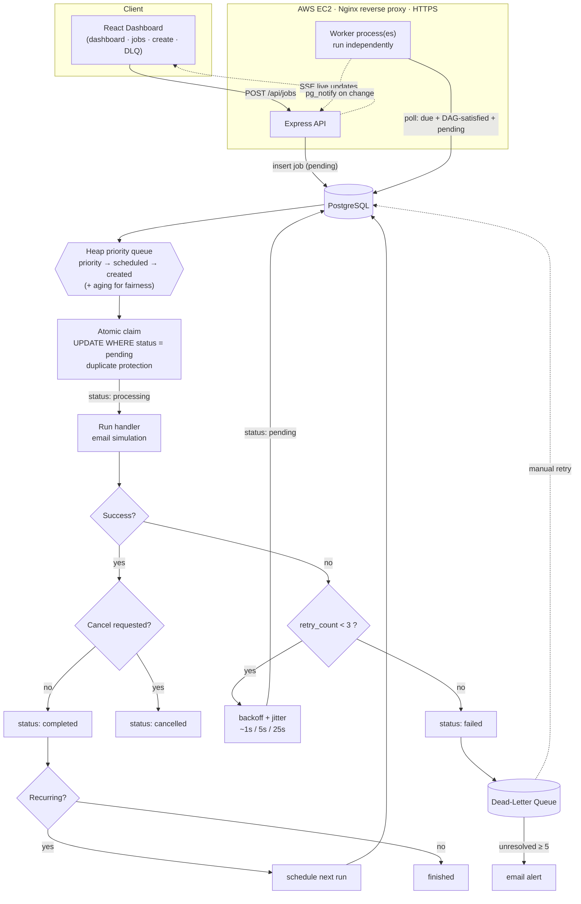

# Architecture — Dilamme Background Job Scheduler

## 1. Overview

The system has three independently running parts that share one PostgreSQL
database:

```
            ┌─────────────┐      HTTP/SSE      ┌──────────────┐
            │   React UI  │◄──────────────────►│   API server │
            └─────────────┘                    │  (Express)   │
                                               └──────┬───────┘
                                                      │ SQL + LISTEN/NOTIFY
                                                      ▼
                                              ┌────────────────┐
                                              │   PostgreSQL   │
                                              └───────┬────────┘
                                                      │ SQL (claim/update)
                                               ┌──────▼───────┐
                                               │  Worker(s)   │  (N processes)
                                               └──────────────┘
```

- **API server** — accepts job CRUD, exposes stats/DLQ, streams live updates.
  It never executes jobs.
- **Worker** — a separate process (`npm run worker`). Polls, claims, executes,
  and updates jobs. You can run many workers; the main app does not wait on them.
- **PostgreSQL** — durable store and the synchronization point. Duplicate
  protection and live updates both lean on Postgres primitives.

### System & job-lifecycle diagram

> Renders on GitHub. Also available interactively on
> [mermaid.live](https://mermaid.live/view#pako:eNptVM1u4zYQfpUBTzGSNNgtcjG2WyiS2hhRHVu24W7NxYKWRjJ3JVLLnzSG4x4L9Np36DP03kfpkxSkJFvd9mKLnG--7-NwhgeSyRzJmBSV_DnbMWVgGVEBAKDttlSs2UGYTOLpckNJWHEUhpL3LQBgNdlQkiLLDERM77aSqfzNVt28vcj7Jfz1J3yUW-3-M4XMoPuKkvnoxIMip-ILzTh8vaEkWC_cl8uYllw8g8InVBqhUfJ577bvl8vZYuAomDlL8XOjUGu3GsTWDxtK1lJ9QuUIMtT6AvXIG1ZWABc5NihyFKba_5-76G5zQclMalMqXMwTSkbv-9hqAtfXb18omT0ulnDDGn7jjk3Ji3chOnMdiAuNyrjCwIWT5KIcOWh0N0B-5aGLRQwVf0KwTc4MesZVR7h-6FFN-UFIw4s9SAHZjokST9JnbAuVVTWG3CJcQhR8f62Z4brgmMMldF6GVqI7lwf3cTA7HCi5R9ZAo7hU3Ozhs0WLvoCnrb9__R10tsPcVpj7VXvtXWNcAiu5KKGQCgrGlUCtR5Qcj62ak_F6YRJMfnAtYGTNM8gqxmvPsJpFwTKG9X2cxqANM1bDN71xj8htU_HMdVqjpMHMcClO1-l5u0q02eO-GbqDp6up62orYMdEXqHypFgzXoHmta3YibClTFdTb_nx4UDJwmaO61tKjn38sa38HvULhME0PFASMpFhBQo_W9QG8xbu_QXT0MOFfIHocRpvzj4zWTcVGszPp-nRJ_I4SeJomOOVqkGOI_V-09hZSTGzSnFRnj2k8YB0Gv_oZr-_UhD4bEDZc0V7tDMcT6NXG0oKLrjeDTQdidd0XfWvqrisNF6m7w6UKDRq_yGTVhh4A1_D0NEyfXf2dBeEbpa3LPskiwIu4SM3pruoX15puIFb9_P6Vp8cuJQvr_2_zX7Wcb6-CybJoJQF48M6umh7pmTu3oUIWX6doDMCczcX7fPgS57MO20rFGpZPbnR-O0PuPVDmsSpK3HbYqxCdX5jfWY74jUTlrmeMWrfeiZXpEZVM56TMTlQYnZYIyVjSnIsmK0MJUdyRZg1crEXGRkbZfGKtA9JxFmpWN1vKmnLHRkXrNJ4RRomfpKyCx7_Afih9vI).
> Source: [`docs/architecture-diagram.mmd`](architecture-diagram.mmd).



## 2. Data model

| Table | Purpose |
|-------|---------|
| `jobs` | every job + its full lifecycle state |
| `job_dependencies` | DAG edges (`job_id` depends on `depends_on_id`) |
| `dead_letter_queue` | jobs that exhausted retries, with error + `resolved` flag |
| `job_logs` | structured lifecycle events (created/started/retry/failed/…) |

## 3. Status flow

```
pending ──► processing ──► completed
                │  ├──► failed      (after retries exhausted → DLQ)
                │  └──► cancelled   (cancel requested while processing)
pending ──────────────────► cancelled (cancelled before it ran)
```

Every transition goes through a service function; nothing writes status ad hoc.

## 4. Required: Heap-based priority queue

`src/queues/heap.ts` is a binary **min-heap** stored in a flat array:

- `parent(i) = (i-1) >> 1`, `left(i) = 2i+1`, `right(i) = 2i+2`
- `push`: append, then **siftUp** — O(log n)
- `pop`: remove root (most urgent job), move last element to root, **siftDown** — O(log n)

Ordering (`src/queues/comparator.ts`) is:

1. **effective priority** (1 High → 3 Low, with aging applied)
2. **scheduled time** (earlier first)
3. **creation time** (FIFO tie-break)

The scheduler (`scheduler.service.ts`) loads only **due, dependency-satisfied,
pending** jobs into the heap — so scheduled jobs enter the heap only once their
time has passed, and recurring jobs re-enter after a new row is inserted on
completion. The heap decides *which* job to claim next; the actual claim is an
atomic SQL update (see §10).

## 5. Required: Alternative algorithm — Hashed Timing Wheel

`src/queues/timingWheel.ts` is a circular array of time-bucket slots. A job due
in `d` ms hashes to slot `(cursor + ceil(d/tick)) % slots` with a `rounds`
counter for delays past one rotation. `advance(now)` walks elapsed ticks and
drains due entries.

### Benchmark (`npm run bench 50000`)

| Operation | Heap | Timing wheel |
|-----------|------|--------------|
| insert 50k | 62.88 ms (795k ops/s) | **41.09 ms (1.22M ops/s)** |
| drain 50k  | 165.55 ms (302k ops/s) | **68.53 ms (730k ops/s)** |

Timing wheel: **1.53× faster insert, 2.42× faster drain.**

**Tradeoff.** The heap gives an *exact global* priority ordering on every pop at
O(log n). The timing wheel is O(1) insert and amortized O(1) per tick, but only
orders *within a slot* — it is ideal for very large volumes of time-scheduled
jobs where coarse priority ordering is acceptable. We use the heap as the
primary scheduler because exact priority + aging ordering is the requirement;
the wheel is provided and benchmarked as the alternative.

## 6. Required: DAG workflow

`job_dependencies` holds edges. A job is eligible only when **every** dependency
has reached `completed`, enforced by a `NOT EXISTS` gate in the eligibility
query. Example: Generate Report → Upload File → Send Email runs strictly in
order.

## 7. Retries, backoff & jitter

`retry_count` counts retries already performed. On failure:

- if `retry_count < MAX_RETRIES (3)` → reschedule to `pending` with
  `delay = BACKOFF_BASE * FACTOR^(attempt-1)` ± `JITTER`
  → **~1s, ~5s, ~25s** (base 1, factor 5, ±20%).
- else → status `failed` and an atomic insert into the dead-letter queue.

Jitter prevents a batch of co-failing jobs from retrying in lockstep.

## 8. Dead-Letter Queue & alert threshold

Exhausted jobs land in `dead_letter_queue` with the error. Engineers inspect
them in the UI and hit **Retry**, which resets the job to `pending` with a fresh
retry budget; if it fails again it returns to the DLQ as a new entry.

**Threshold:** `DLQ_ALERT_THRESHOLD = 5` (configurable in `.env`). When the count
of *unresolved* DLQ entries reaches the threshold, an email alert is sent to
`ALERT_EMAIL_TO` (mocked transport, structured-logged as `dlq.alert`).

## 9. Scheduled & recurring jobs

- **Scheduled:** a future `scheduled_at` keeps the job out of the eligible set
  until the time passes.
- **Recurring:** on completion of a job with `recurring_interval`
  (`every_1_minute` / `every_5_minutes` / `every_1_hour`), the worker inserts the
  next occurrence automatically — no user action.

## 10. Duplicate protection

A job is claimed with:

```sql
UPDATE jobs SET status='processing', locked_by=$worker, ...
 WHERE id=$1 AND status='pending'
 RETURNING *;
```

Postgres row-locks the update, so if two workers pop the same heap candidate,
only one finds the row still `pending`; the other gets 0 rows and moves on. This
holds even with a single worker. A short-window job-claim race is therefore
impossible.

## 11. Starvation prevention (aging)

Effective priority improves by one level for every `AGING_BUMP_SECONDS = 30` a
job waits since creation, clamped at High. So a Low job waiting 60s becomes
effectively High and stops being starved by a steady stream of fresh High jobs.
Implemented in `effectivePriority()` and applied in the comparator.

## 12. Logging

`src/utils/logger.ts` emits one structured JSON line per event **and** persists
it to `job_logs`. Covered events: `job.created`, `job.started`, `job.retry`,
`job.failed`, `job.cancelled`, `job.completed`, plus `job.dead_lettered`,
`job.recurring_scheduled`, `dlq.alert`.

## 13. Live updates (SSE)

Workers and the API call `pg_notify('job_events', …)` on every change. The API
holds a dedicated `LISTEN` connection and relays each notification to browsers
over `GET /api/events` (Server-Sent Events). The UI refreshes on each event — no
page reload. Cross-process delivery works because the bus is Postgres, not
in-memory.

## 14. Deployment

Self-managed AWS EC2 (no managed PaaS): Node API + N worker processes under
pm2, PostgreSQL on the box, **Nginx** as reverse proxy, **HTTPS** via Let's
Encrypt/Certbot, and a public domain via dynamic DNS. See `deploy/nginx.conf`
and the README deployment section.
